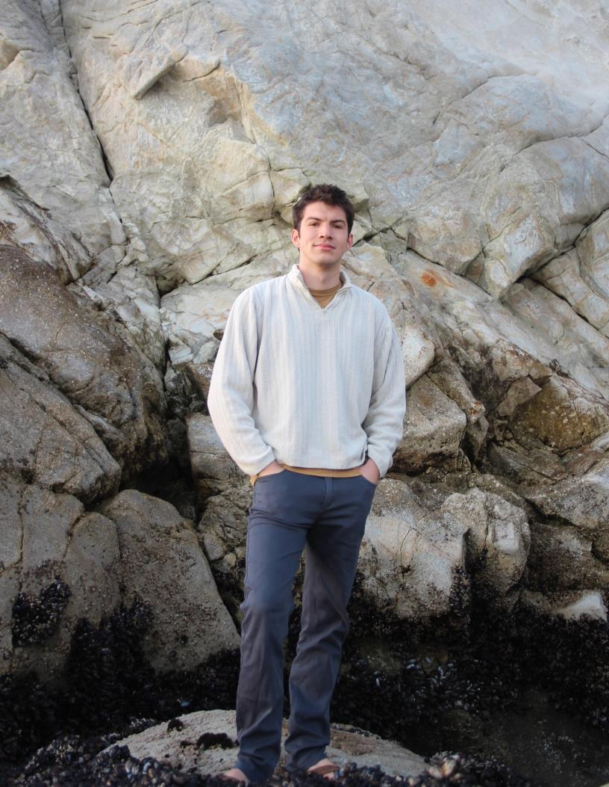

## About Me

I work as a backend compiler engineer at NVIDIA. I contribute the LLVM project
and act as a mantainer for the NVPTX backend in LLVM.
My interests include programming languages, static analysis, compilation, functional programming,
and natural language processing.
Outside of work
I enjoy hiking, backpacking, swimming, and cycling.

I am a graduate of California Polytechnic State University in San Luis Obispo,
where I received a Bachelors degree in Computer Science.

I have not updated this website since the winter of 2026

## Contact

**e-mail:** alex [ at ] alex-maclean [ dot ] com
